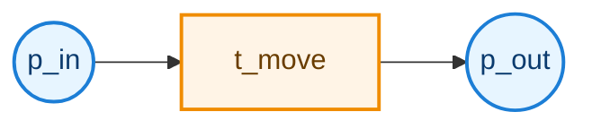
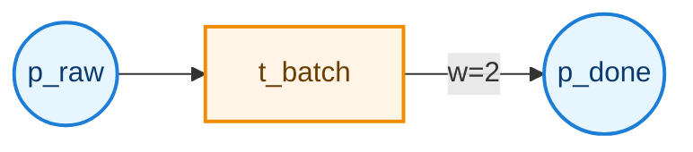
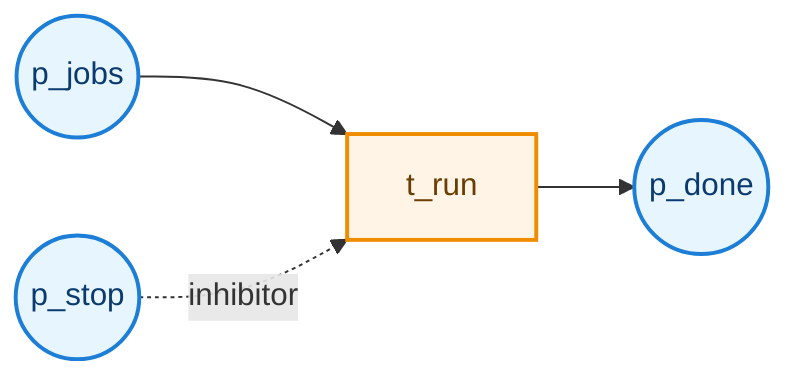
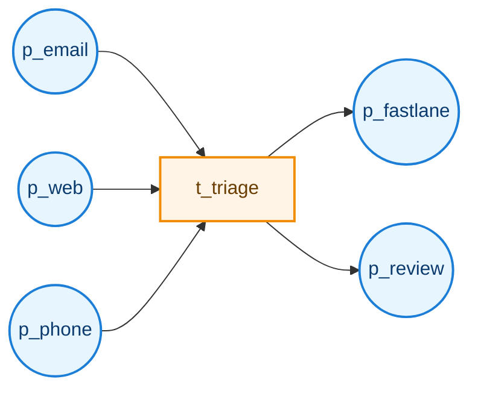

# The Arc Language

A quick reference for describing small to medium Petri nets in a compact text form.

## Why Use It

The arc language is efficient because it lets you define structure and initial state in a few lines:

- Places and transitions are inferred from arc direction.
- Weighted arcs and inhibitor arcs are encoded inline.
- Groups of places/transitions can be expanded with set notation.
- Initial marking is captured in the same spec.

For simple nets, this is often much shorter and easier to diff than verbose XML-based formats.

## Core Shape

```text
PetriNet <name> <
  <arc-spec>; 
  <arc-spec>; 
>
<optional marking entries>
```

Minimal parser-ready form is typically one line:

```text
PetriNet net < p1)-[t1; t1]-(p2; > p1=1; p2=0;
```

## Quick Syntax Reference

- `PetriNet <name> < ... >`: net declaration and arc block.
- `ident`: place or transition identifier (letters/digits, starts with letter).
- `;`: terminates each arc spec and each marking entry.
- Place-to-transition arc (input arc): `place ) ... [ transition`
- Transition-to-place arc (output arc): `transition ] ... ( place`
- Weight: place/transition end marker followed by optional `number`.
- Inhibitor marker: optional `o` in an input arc.
- Set notation: `{p1,p2,p3}` or `{t0,t1}` for fan-in/fan-out.
- Marking entry: `<place>=<tokens>;`

### Arc Pattern Details

Input arc (place to transition):

Shape:

```text
<place>) { - } [<weight>] { - } [o] { - } [<transition>
```

Character meaning:

- `)` closes the place endpoint (source side for an input arc).
- `-` is a connector segment. You may use zero or more dashes at each connector position.
- `<weight>` is an optional positive integer. If omitted, weight defaults to 1.
- `o` is the optional inhibitor marker (only valid on input arcs).
- `[` opens the transition endpoint.

Ordering rules:

- After `)`, dashes are optional.
- If a number is present, it must come before the optional `o`.
- If `o` is present, it must come before the final `[`.
- Extra dashes are allowed before the number, between number and `o`, and before `[`. This includes repeated dash runs.
- Input arcs may include `o`; output arcs may not.

```text
p0)-[t0;
p0)2-[t0;
p0)-2-o-[t0;
p0)---2----o-----[t0;
```

Output arc (transition to place):

Shape:

```text
<transition>] { - } [<weight>] { - } (<place>
```

Character meaning:

- `]` closes the transition endpoint (source side for an output arc).
- `-` is a connector segment. You may use zero or more dashes at each connector position.
- `<weight>` is an optional positive integer. If omitted, weight defaults to 1.
- `(` opens the place endpoint.

Ordering rules:

- After `]`, dashes are optional.
- If a number is present, it must appear before `(`.
- Extra dashes are allowed before and after the number.
- `o` is not valid in output-arc syntax.

```text
t0]-(p1;
t0]2-(p1;
t0]---2----(p1;
```

## Worked Examples

### 1) Smallest Useful Net

Arc spec:

```text
PetriNet one_step < p_in)-[t_move; t_move]-(p_out; > p_in=1; p_out=0;
```



Figure 1. Single-step token flow from `p_in` to `p_out` via `t_move`.

### 2) Weighted Production Arc

Arc spec:

```text
PetriNet weighted_output < p_raw)-[t_batch; t_batch]2-(p_done; > p_raw=3; p_done=0;
```



Figure 2. Transition `t_batch` emits 2 tokens to `p_done` per firing.

### 3) Inhibitor Gate

Arc spec:

```text
PetriNet gated < p_jobs)-[t_run; p_stop)-o-[t_run; t_run]-(p_done; > p_jobs=5; p_stop=0; p_done=0;
```



Figure 3. `p_stop` inhibits `t_run` when it holds tokens.

### 4) Fan-in / Fan-out with Sets (Simple Workflow)

Arc spec:

```text
PetriNet triage < {p_email,p_web,p_phone})-[t_triage; t_triage]-({p_fastlane,p_review}; > p_email=2; p_web=1; p_phone=1; p_fastlane=0; p_review=0;
```



Figure 4. Multi-channel intake converges at `t_triage`, then branches to two outcomes.

## Practical Modeling Notes

- Keep names semantic (`p_queue`, `t_dispatch`) to make specs self-documenting.
- Use sets when many arcs share the same transition endpoint.
- Use inhibitor arcs for lockout/guard behavior.
- Keep marking entries near the corresponding model to avoid mismatches.

## Real-World Patterns to Try Next

- Order pipeline: `new -> paid -> packed -> shipped`
- Incident response: `alert -> triage -> resolve`, with inhibitor for maintenance windows
- Manufacturing cell: multiple feed places into one batch transition with weighted output

If you want, this guide can be extended with a section mapping each arc-language construct to the underlying builder API calls.
